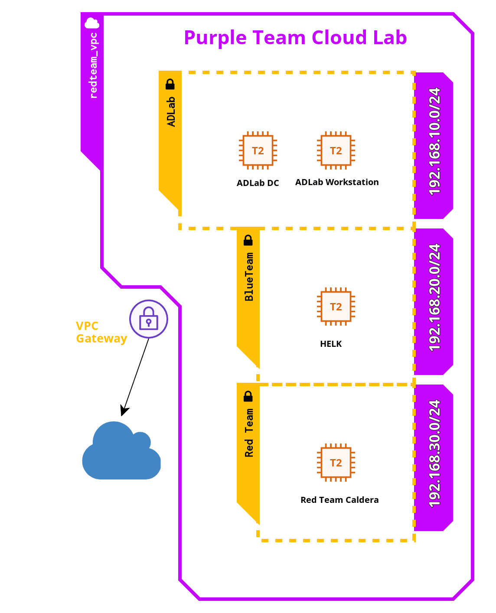

# Overview
Purpler Team Cloud Lab is a cloud-based AD lab created to help you test real attacks in a controlled environment and create detection rules for them. It was originally created for MalTrak training: "In-depth Investigation & Threat Hunting" and now we decided to make it open-source and available for everyone.

This lab is built on AWS and includes an Active Directory domain consisting of a Domain Controller (DC) and a workstation, both running Windows Server 2019 and Windows 10 with Sysmon and Winlogbeat installed. Logs are shipped to the Blue Team network, which runs Threat Hunting ELK (HELK) to monitor domain activity, support investigations, and help create detection rules.

The Red Team network includes Caldera for automated adversary simulation, but also supports Atomic Red Team, now deployed on both domain machines, for manual execution of specific MITRE ATT&CK techniques.

Recent improvements include:
- ✅ **Converted Windows setup from PowerShell scripts to Ansible playbooks**, making configuration cleaner, modular, and easier to manage or extend.
- ✅ **Added IP whitelisting to Terraform** to restrict access to the infrastructure.
- ✅ **Fixed issues with available images on AWS.**

# Design


# Installation Tutorial

## Machines
* **Red Team Caldera**: Amazon Linux 2 (Redhat-based), t2.micro
* **Blue Team HELK**: Amazon Linux 2, t2.large (8 GB RAM, 2 vCPU), 30 GB storage
* **ADLAB Machines**: Windows Server 2019 DC and Workstation, t2.micro

# Installation

## Prerequisites:
* An AWS Account
* AWS CLI installed and configured
* Terraform installed and added to your system PATH
* A Unix/Linux/Mac host system (Ansible is now used instead of PowerShell scripts)
* Python3, pip, and virtualenv
* Required Ansible collections:
  ```bash
  pip install ansible
  ansible-galaxy collection install ansible.windows community.windows chocolatey.chocolatey
  ```
* Optional but recommended: `python3 -m venv venv && source venv/bin/activate`

## Installation
1. Create a new AWS IAM user with administrator permissions and retrieve the ACCESS and SECRET keys.
2. Run `aws configure` and enter your credentials. Set region to `us-east-1` (or change in Terraform config).
3. In AWS Console > EC2 > Key Pairs, create `ec2_key_pair` (all lowercase) and download the `.pem` file.
4. Move the `.pem` file to `~/.ssh/` and rename it to `id_rsa`, then run `chmod 600 ~/.ssh/id_rsa`.
5. Clone this repository:
   ```bash
   git clone https://github.com//purpler-team-cloud-lab.git
   cd purpler-team-cloud-lab
   ```
6. Initialize and apply Terraform:
   ```bash
   terraform init
   terraform apply
   ```
   Type `yes` to begin provisioning. It will take ~40 minutes.
7. After terraform provisioning run ./generate_inventory.sh to populate the inventory file for ansible.
Run ansible-playbook -i inventory.ini ansible/dc_setup.yml wait for the playbook to finish
then run ansible-playbook -i inventory.ini ansible/workstation_setup.yml

8. Enjoy!
To destroy the lab:
```bash
terraform destroy
'''
## Credentials
- **Windows Local Admin**: Administrator / LabPass1
- **Domain Admin**: adlab\ddean / LabPass1
- **Workstation User**: adlab\kbaehr / LabPass1
- **HELK Web UI**: https://<blueteam-ip> — Username: helk / Password: LabPass1
- **Red Team Web UI (Caldera)**: http://<redteam-ip>:8888 — red / LabPass1 or blue / LabPass1

# Capabilities

## ADLAB Domain
The ADLAB domain includes:
- Windows Server 2019 DC and workstation
- Ansible-managed domain setup (replaces previous PowerShell scripts)
- Sysmon + Winlogbeat pre-installed
- Chocolatey-installed tooling (Wireshark, Chrome, etc.)
- Atomic Red Team tooling

The switch to Ansible allows easier extensibility and modular role-based configuration. IP whitelisting ensures that the environment is not openly exposed.

## Blue Team HELK
- Full HELK stack with Elasticsearch, Logstash, Kibana, and Elastalert
- Preconfigured to ingest logs from Winlogbeat
- PowerShell Remoting to AD machines (using Negotiate/NTLM)
- DFIR tooling: Kansa, Kape, Volatility 2 & 3
- Memory acquisition tool DumpIt included

## Red Team Caldera
- Caldera red team automation platform
- Control ADLAB endpoints via agents
- Execute MITRE ATT&CK techniques
- Atomic Red Team already installed on endpoints

# Use Cases
- Simulate attacker behavior and collect forensic artifacts
- Write and test detection rules
- Purple teaming exercises
- SIEM/EDR/DFIR evaluation
- Live memory collection and forensics
- Safe AD lab for hands-on practice

